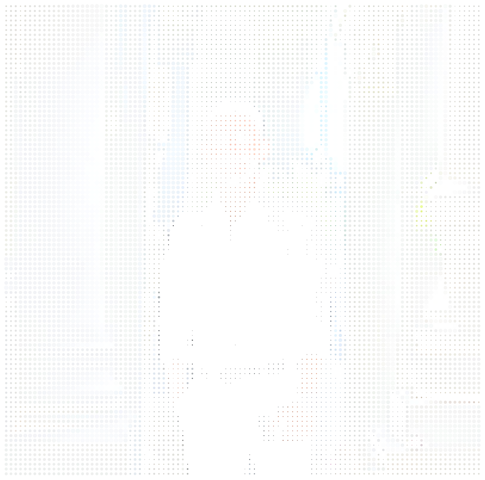
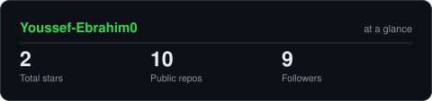
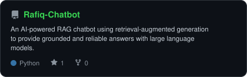
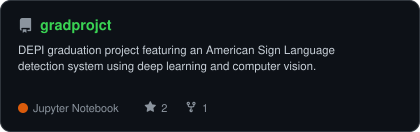
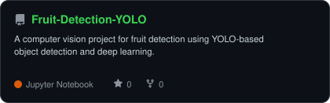
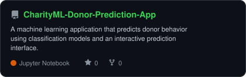

<div align="center">

<!-- PORTRAIT - generated from me.jpeg -->



<br>

<!-- NAME / TAGLINE -->

<a href="https://github.com/Youssef-Ebrahim0">

  

</a>

<br>

<!-- SOCIALS -->

<a href="https://github.com/Youssef-Ebrahim0"></a>

<a href="www.linkedin.com/in/youssef-ebrahim01"></a>

<a href="mailto:youssefebrahim299@gmail.com"></a>


</div>

---

## `~/` whoami

```console
$ cat about.txt
```

Hi, I'm **Youssef Ebrahim**. I'm an **AI & Data Science student** focused on building practical machine learning systems, LLM applications, and computer vision solutions.

* 🎓 B.Sc. in Computers & Information Technology — **AI & Data Science**, Zagazig University
* 🤖 Focused on **Machine Learning, Deep Learning, NLP, LLMs, RAG, and Computer Vision**
* 🚀 Building AI applications using **Python, TensorFlow, scikit-learn, LangChain, FastAPI, and Docker**
* 💼 Machine Learning Engineer @ **DEPI**
* 📚 Currently expanding my knowledge in **LLM workflows, Retrieval-Augmented Generation, and production AI systems**
* 💡 Fun fact: I enjoy turning machine learning concepts into working applications.

<br>

<div align="center">

## `~/` toolbox


<br><br>


</div>

---

<div align="center">

## `~/` skill radar

<table>

<tr>

<td width="50%" align="center" valign="middle">

<!-- Self-rated radar - edit assets/skills.json, the workflow redraws it -->

<picture>

  <source media="(prefers-color-scheme: dark)" srcset="assets/radar-dark.svg">

  <source media="(prefers-color-scheme: light)" srcset="assets/radar-light.svg">

  

</picture>

</td>

<td width="50%" align="center" valign="middle">

<!-- Live radar built from real language byte counts across your repos -->

<picture>

  <source media="(prefers-color-scheme: dark)" srcset="assets/radar-langs-dark.svg">

  <source media="(prefers-color-scheme: light)" srcset="assets/radar-langs-light.svg">

  

</picture>

</td>

</tr>

</table>

</div>

---

<div align="center">

## `~/` contribution calendar

<!-- 3D isometric calendar, regenerated every 6h by .github/workflows/metrics.yml -->


<br><br>

<!-- Snake eats the contribution graph - .github/workflows/snake.yml -->

<picture>

  <source media="(prefers-color-scheme: dark)" srcset="https://raw.githubusercontent.com/Youssef-Ebrahim0/Youssef-Ebrahim0/output/snake-dark.svg">

  <source media="(prefers-color-scheme: light)" srcset="https://raw.githubusercontent.com/Youssef-Ebrahim0/Youssef-Ebrahim0/output/snake.svg">

  

</picture>

</div>

---

<div align="center">

## `~/` the numbers

<!-- Generated by scripts/cards.py -->

<picture>

  <source media="(prefers-color-scheme: dark)" srcset="assets/card-stats-dark.svg">

  <source media="(prefers-color-scheme: light)" srcset="assets/card-stats-light.svg">

  

</picture>

<br>


<br><br>


</div>

---

<div align="center">

## `~/` selected work

<table>
<tr>
<td width="50%" align="center">

<a href="https://github.com/Youssef-Ebrahim0/Rafiq-Chatbot">

</a>

</td>

<td width="50%" align="center">

<a href="https://github.com/DEPI-Poject-Team-1/gradprojct">

</a>

</td>
</tr>

<tr>

<td width="50%" align="center">

<a href="https://github.com/Youssef-Ebrahim0/Fruit-Detection-YOLO">

</a>

</td>

<td width="50%" align="center">

<a href="https://github.com/Youssef-Ebrahim0/CharityML-Donor-Prediction-App">

</a>

</td>

</tr>
</table>

<br>

| Project | Stack |
|---|---|
| **[Rafiq-Chatbot](https://github.com/Youssef-Ebrahim0/Rafiq-Chatbot)** | `Python` `LangChain` `RAG` `LLM` |
| **[gradprojct](https://github.com/DEPI-Poject-Team-1/gradprojct)** | `Python` `TensorFlow` `Computer Vision` |
| **[Fruit-Detection-YOLO](https://github.com/Youssef-Ebrahim0/Fruit-Detection-YOLO)** | `Python` `YOLO` `Computer Vision` |
| **[CharityML-Donor-Prediction-App](https://github.com/Youssef-Ebrahim0/CharityML-Donor-Prediction-App)** | `Python` `Scikit-learn` `Machine Learning` |

</div>

---

<div align="center">

<sub>`01100001 01101001 00100000 01100101 01101110 01100111 01101001 01101110 01100101 01100101 01110010 01101001 01101110 01100111`</sub>

</div>
